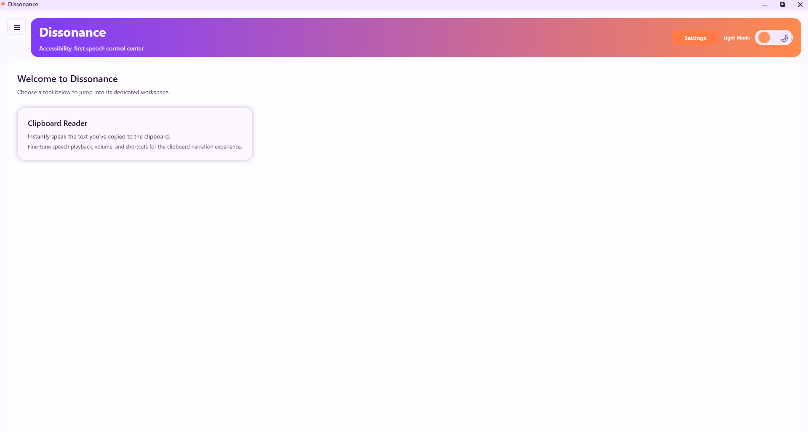

# Dissonance Accessibility Tool

Dissonance is a Windows desktop application that empowers visually impaired users to interact with rich on-screen content. It combines real-time screen capture with accessible presentation layers so that critical information can be reviewed or read aloud.

## Key Features

- **Clipboard Reader** – Automatically ingests copied text and presents it in a customizable reading pane with text-to-speech integration.
- **Session History** – Preserves previously captured snippets, making it easy to revisit important information.
- **Text-to-Speech Controls** – Works with installed Windows voices and provides rate and volume adjustments.
- **Theming** – Light and dark themes ensure comfortable viewing in a range of environments.
- **Extensible Architecture** – Service- and manager-based abstractions make it straightforward to add new capture or export pipelines.

## Getting Started

### Prerequisites

- Windows 10 or later
- .NET Desktop Runtime 8.0 (for running) or .NET SDK 8.0 (for development)

### Installation

1. Clone the repository.
2. Restore the solution dependencies: `dotnet restore`.
3. Build the application: `dotnet build Dissonance.sln`.
4. Launch the app from the generated binaries in `Dissonance/bin/`.

## Usage Overview

1. Launch Dissonance.
2. Copy any text from another application.
3. Switch to the Clipboard Reader view to review, edit, or listen to the captured content.
4. Use the toolbar to toggle themes or access additional utilities.

## Architecture Highlights

- **Services** encapsulate integrations such as speech synthesis and clipboard monitoring.
- **Managers** coordinate domain logic like session history and UI state transitions.
- **ViewModels** implement MVVM bindings for the WPF views, ensuring testability and separation of concerns.

## Accessibility Considerations

- Provides full text-to-speech playback with configurable voice, rate, and volume.
- Offers light and dark themes to accommodate different contrast needs.
- Includes keyboard shortcuts and hotkeys so core actions remain accessible without a mouse.

## Contributing

1. Fork the repository and create a feature branch.
2. Run the test suite with `dotnet test`.
3. Submit a pull request with a detailed description of your changes.

## License

This project is released under the MIT License. See the [`LICENSE`](LICENSE) file for details.

## Additional Resources

For more detailed walkthroughs and design notes, see the [project wiki](./wiki/Home.md).
