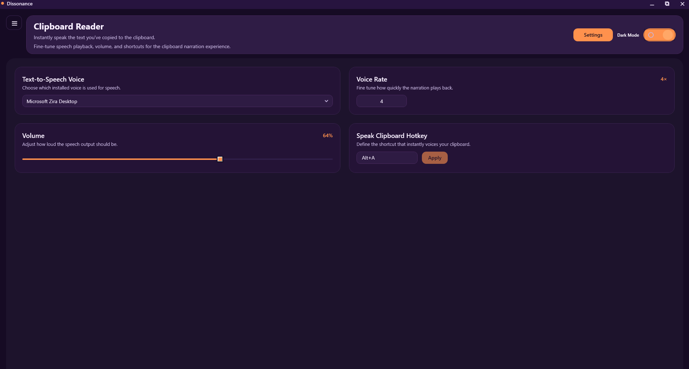

# Clipboard Reader

The Clipboard Reader is the heart of Dissonance. It continuously monitors the system clipboard and surfaces content in an accessible format.

## Workflow

1. Copy text in any Windows application.
2. Dissonance captures the clipboard contents and adds it to the session history.
3. The Clipboard Reader view displays the captured text alongside speech playback controls and entry metadata.

## Key Components

- **ClipboardService** – Listens for clipboard updates and publishes new entries.
- **HistoryManager** – Stores clipboard snapshots and provides filtering and retrieval utilities.
- **ClipboardReaderViewModel** – Bridges the UI and services, exposing properties for the WPF views.

## Tips for Power Users

- Use keyboard shortcuts to navigate between history items without leaving the reader view.
- Play, pause, or stop narration directly from the reader toolbar.
- Adjust the voice, rate, and volume to match the context you are working in.

## Troubleshooting

If clipboard monitoring stops working:

- Confirm no other application has locked the clipboard.
- Restart Dissonance to re-initialize the listener hooks.
- Check the application logs for exceptions or warnings.
